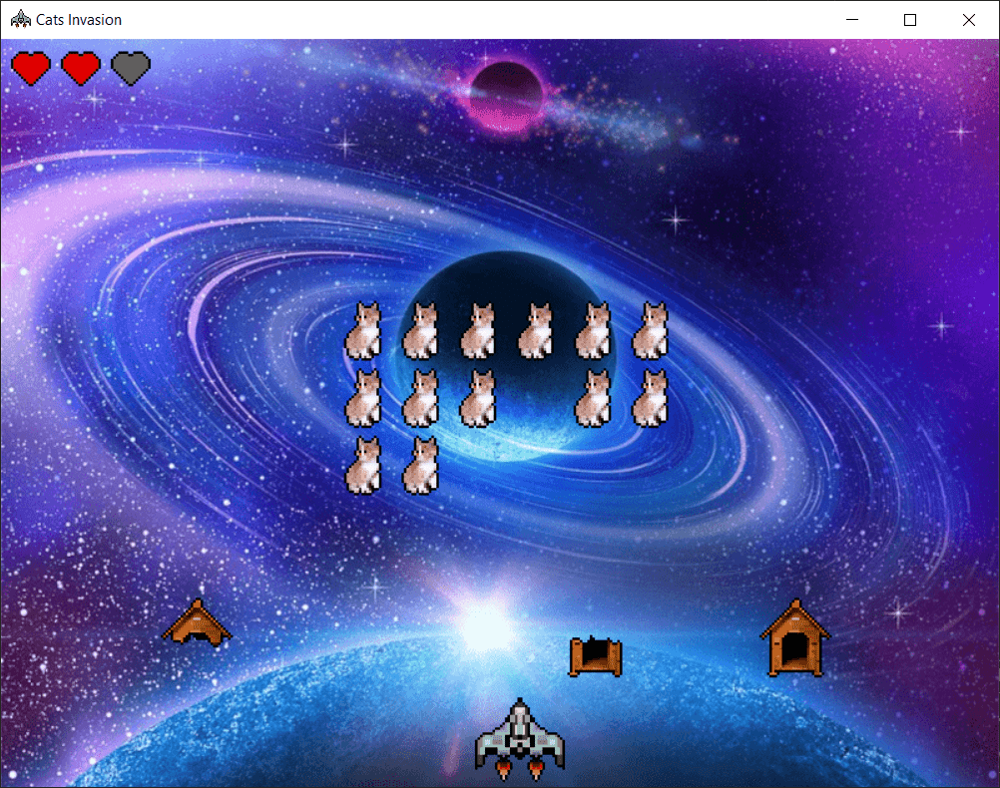

# Cats Invasion

Space invaders like with cats programmed assembly language.

## Preview



## Build

For build the project you need two steep :

```sh
sudo apt-get install libgtk-3-dev make
make
```

If you change an image, you need to clean the project before with the following comand :

```sh
make clean
```

## Run

```sh
./build/SpaceInvaders
```

## Developpement

- Indentation : `8 spaces`
- Label : `snake_case`
- Inner label : `_function__[if|for|while][...]`

## Attribution

- [void.bmp](https://www.flickr.com/photos/138248475@N03/23412278894)
